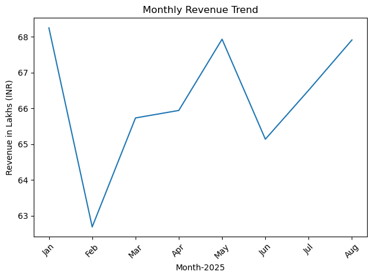
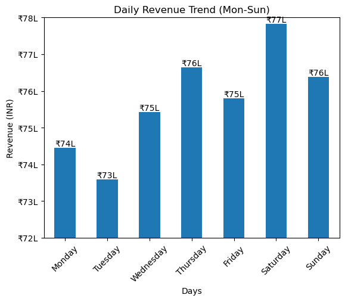
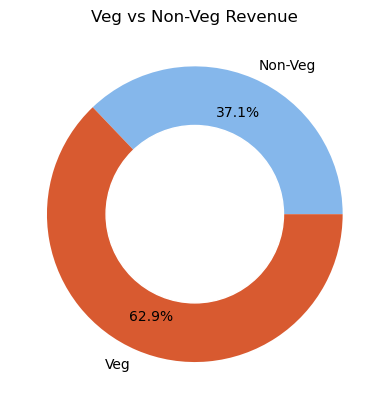
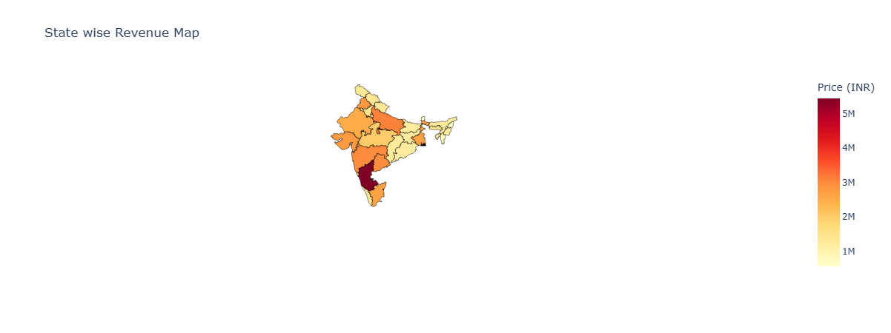
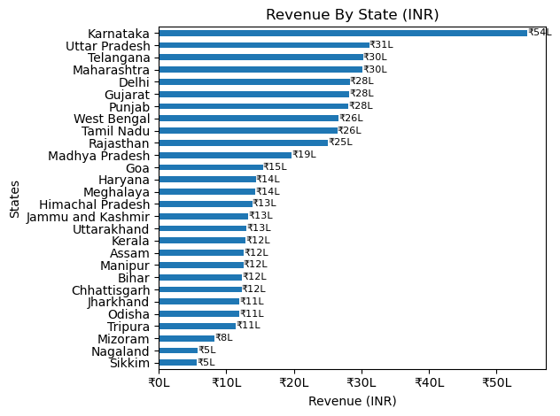
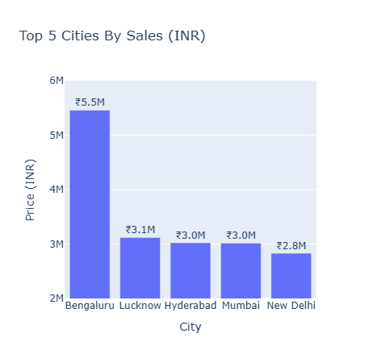
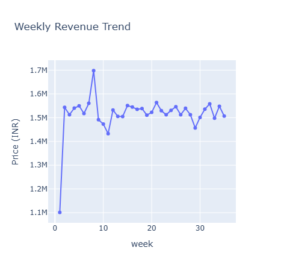

# 🍊 Swiggy Sales Analysis

Welcome to my analysis of Swiggy's food delivery sales data. This project was built to explore and understand Swiggy's business performance across cities, states, food types, and time periods. Using Python and various visualization libraries, I uncover key trends and insights that can guide data-driven decisions.

# ❓ The Questions

Below are the questions I wanted to answer through this project:

1. What is the overall sales performance of Swiggy? *(KPIs)*
2. How does revenue trend across months and weeks?
3. Which days of the week generate the most revenue?
4. How do Veg vs Non-Veg food categories compare in sales?
5. Which states and cities contribute the most to Swiggy's revenue?
6. How does performance vary across quarters?


# 🛠️ Tools I Used

For this analysis, I used the following tools and libraries:

- **Python** — Core language for data analysis and visualization
  - **Pandas** — Data manipulation, grouping, and aggregation
  - **NumPy** — Numerical operations and conditional logic
  - **Matplotlib** — Static chart creation
  - **Seaborn** — Enhanced visual styling
  - **Plotly Express** — Interactive charts and choropleth map
  - **Requests** — Fetching GeoJSON data for India map
- **Jupyter Notebook** — Interactive development and analysis environment
- **Excel (.xlsx)** — Source data format
- **Git & GitHub** - Essential for version control and sharing my Python code and analysis, ensuring collaboration and project tracking.

# 📦 Data Preparation & Cleanup

## Import Libraries

```python
import pandas as pd
import numpy as np
import matplotlib.pyplot as plt
import seaborn as sns
import plotly.express as px
```

## Import Data

```python
df = pd.read_excel("swiggy_data.xlsx")
```

## Metadata Overview

```python
print('No. of rows:', df.shape[0])
print('No. of columns:', df.shape[1])
```

**Output:**
```
No. of rows: 197430
No. of columns: 10
```

The dataset contains **197,430 orders** across **10 columns** including Order Date, Price (INR), Rating, Rating Count, City, State, and Dish Name.

# 📊 KPIs

| KPI | Value |
|-----|-------|
| 💰 **Total Sales (INR)** | ₹5,30,12,505.77 |
| ⭐ **Average Rating** | 4.3 |
| 🧾 **Average Order Value (₹)** | ₹268.51 |
| 📝 **Total Ratings Count** | 55,91,574 |
| 📦 **Total Orders** | 1,97,430 |

### Code

```python
total_sales = round(df['Price (INR)'].sum(), 2)
Average_rating = round(df['Rating'].mean(), 1)
Average_order_value = round(df['Price (INR)'].mean(), 2)
rating_count = df['Rating Count'].sum()
total_orders = len(df)
```

# 📈 The Analysis

## 1. Monthly Sales Trend

To understand how revenue changes month by month, I parsed the Order Date and grouped sales by month.

view my notebook with detailed steps here: [Charts Design.Monthly Sales Trend](Project.ipynb)

### Visualise Data

```python
monthly_revenue = df.groupby(['Order Year-Month','Order Month'])['Price (INR)'].sum().reset_index()

monthly_revenue.plot(kind='line',x='Order Month',y='Price (INR)',rot=45)
plt.xlabel("Month-2025")
plt.ylabel("Revenue in Lakhs (INR)")
plt.title("Monthly Revenue Trend")

plt.show()
```

### Results



### Insights

- January recorded the highest revenue at approximately ₹68L, indicating a strong start to 2025.
- Revenue saw a sharp decline in February, dropping to the lowest point of ~₹63L — likely due to fewer days in the month.
- A steady recovery began from March onwards, with revenue gradually climbing back up through April and May.
- May matched January's peak (~₹68L), showing a mid-year demand surge, possibly due to summer ordering patterns.
- A slight dip occurred in June (~₹65L), followed by a consistent upward trend through July and August, suggesting growing order momentum heading into Q3.

## 2. Daily Sales Trend

To identify which days of the week drive the most orders and revenue:

### Visualise Data

```python

daily_revenue = df.groupby(['DayNumber', 'DayName'])['Price (INR)'].sum().reset_index()

fig, ax = plt.subplots()

daily_revenue.plot(kind='bar', x='DayName', y='Price (INR)', rot=45, ax=ax)

ax.yaxis.set_major_formatter(plt.FuncFormatter(lambda y, _: f'₹{int(y/100000)}L'))
ax.set_ylim(7200000, 7800000)
ax.set_title('Daily Revenue Trend (Mon-Sun)')
ax.set_xlabel('Days')
ax.set_ylabel('Revenue (INR)')
ax.get_legend().remove()
plt.show()
```

### Results


### Insights

- Saturday is the strongest revenue day of the week at ₹77L, closely followed by Thursday and Sunday (both at ₹76L), suggesting peak ordering happens around the end of the week.
- Tuesday has the lowest revenue at ₹73L, making it the weakest day — possibly due to mid-week routine and fewer social dining occasions.
- The overall daily revenue range is narrow (₹73L–₹77L), indicating Swiggy maintains fairly consistent order volumes every day — there are no extreme off-days.
- Monday (₹74L) shows a slight post-weekend dip, recovering progressively through the week up to Saturday's peak.


## 3. Total Sales by Food Type (Veg vs Non-Veg)

I categorized dishes using keyword matching to classify each order as Veg or Non-Veg:

### Visualise Data

```python
non_veg_keywords = [
    "chicken", "egg", "fish", "mutton",
    "prawn", "biryani", "kabab", "kebab",
    "non-veg", "non veg"
]

df['Food Category'] = np.where(
    df['Dish Name'].str.lower().str.contains('|'.join(non_veg_keywords), na=False),
    'Non-Veg',
    'Veg'
)

food_revenue = df.groupby('Food Category')['Price (INR)'].sum().reset_index()

fig, ax = plt.subplots()
food_revenue.plot(
    kind='pie',
    labels=food_revenue['Food Category'],
    y='Price (INR)',
    autopct='%1.1f%%',
    colors=['#85B7EB', '#D85A30'],
    ax=ax,
    pctdistance=0.75
)
ax.add_artist(plt.Circle((0, 0), 0.6, color='white'))
ax.set_title('Veg vs Non-Veg Revenue')
plt.show()
```

### Results


### Insights
- Veg food dominates Swiggy's revenue with a commanding 62.9% share, significantly outperforming Non-Veg.
- Non-Veg contributes 37.1% of total revenue — this is notable considering popular Non-Veg items like Biryani, Chicken, and Fish typically have higher price points.
- The Veg dominance suggests that Swiggy's user base largely consists of vegetarian or flexitarian consumers, or that Veg menus have a much wider variety driving higher overall order volumes.
- Despite lower revenue share, Non-Veg's 37% is still a substantial segment worth targeting with promotions or combo deals.

## 4. Total Sales by State (Map Visualization)

I used Plotly's choropleth map with India's GeoJSON to visualize state-wise revenue:

### Visualise Data

```python
import requests

url = "https://gist.githubusercontent.com/jbrobst/56c13bbbf9d97d187fea01ca62ea5112/raw/..."
geojson_data = requests.get(url).json()

fig = px.choropleth(
    State_revenue,
    geojson=geojson_data,
    featureidkey='properties.ST_NM',
    locations='State',
    color='Price (INR)',
    color_continuous_scale='YlOrRd',
    title='State wise Revenue Map'
)
fig.update_geos(fitbounds="locations", visible=False)
fig.show()
```

### Results




### Insights
- Karnataka dominates all other states by a large margin with ₹54L in revenue — nearly 75% more than the second-highest state, highlighting Bengaluru's massive contribution.
- Uttar Pradesh (₹31L) ranks second, followed closely by Telangana (₹30L) and Maharashtra (₹30L), forming a strong mid-tier cluster.
- Delhi (₹28L), Gujarat (₹28L), and Punjab (₹28L) are tied at the same revenue level, suggesting similar market penetration in these states.
- Smaller states like Mizoram (₹8L), Nagaland (₹5L), and Sikkim (₹5L) contribute the least — indicating low Swiggy presence or sparse population density in these regions.
- There is a clear North-South divide: Southern states (Karnataka, Telangana) and Northern states (UP, Delhi, Punjab) lead, while North-Eastern states lag significantly.

## 5. Quarterly Performance Summary

### Visualise Data

```python
df['Quarter'] = df['Order Date'].dt.to_period("Q").astype(str)

Quarterly_summary = df.groupby('Quarter', as_index=False).agg(
    Total_sales=('Price (INR)', 'sum'),
    Avg_Ratings=('Rating', 'mean'),
    Total_orders=('Order Date', 'count')
)
```

### Results

| Quarter | Total Sales (₹) | Avg Ratings | Total Orders |
|---------|----------------|-------------|--------------|
| 2025Q1  | 1,96,67,821.77 | 4.34        | 73,096       |
| 2025Q2  | 1,99,02,256.59 | 4.34        | 74,163       |
| 2025Q3  | 1,34,42,427.41 | 4.34        | 50,171       |

### Insights
- Q2 (₹1.99Cr, 74,163 orders) is the strongest quarter, narrowly edging out Q1 — contrary to the common assumption that Q1 leads.
- Q1 (₹1.97Cr, 73,096 orders) is nearly identical to Q2, showing very consistent performance in the first half of 2025.
- Q3 (₹1.34Cr, 50,171 orders) shows a significant drop — roughly 33% lower in both sales and orders compared to Q1/Q2. However, this is likely because Q3 data only covers partial months (the dataset goes up to August), not a true seasonal decline.
- Average Ratings are remarkably stable across all three quarters — 4.342 (Q1), 4.340 (Q2), and 4.342 (Q3) — showing that customer satisfaction is completely unaffected by order volume changes.
- The near-identical ratings across quarters suggest Swiggy's service quality is consistent and reliable regardless of how busy or slow the period is.

## 6. Top 5 Cities by Sales

### Visualise Data

```python
Top_5_Cities = df.groupby('City', as_index=False)['Price (INR)'].sum() 
                 .sort_values("Price (INR)", ascending=False).head().reset_index()

fig = px.bar(
    Top_5_Cities,
    x='City',
    y='Price (INR)',
    title='Top 5 Cities By Sales (INR)',
    text='Price (INR)'
)
fig.update_traces(texttemplate='₹%{text:.2s}', textposition='outside')
fig.show()
```

### Results



### Insights

- The top 5 cities collectively drive a significant portion of Swiggy's total national revenue.
- Karnataka's dominance at the state level is largely driven by Bengaluru, which is expected to be the top contributing city.
- The concentration of revenue in a few metro cities underscores Swiggy's urban-first business model.
- There is a clear drop-off between the top 1-2 cities and the rest of the top 5, suggesting heavy reliance on Tier-1 metros.


## 7. Weekly Trend Analysis

### Visualise Data

```python
df['week'] = df['Order Date'].dt.isocalendar().week

weekly_revenue = df.groupby('week')['Price (INR)'].sum().reset_index()

fig = px.line(
    weekly_revenue,
    x='week',
    y='Price (INR)',
    title='Weekly Revenue Trend',
    markers=True
)
fig.show()
```

### Results


### Insights
- Weekly revenue shows a generally stable pattern across the year with periodic fluctuations.
- Certain weeks register sharp spikes, likely coinciding with festive seasons, promotional campaigns, or long weekends.
- A few weeks show notable dips — possibly reflecting data gaps or periods of low promotional activity.
- The overall trend suggests Swiggy maintains a steady baseline of orders week-over-week, with growth potential during peak events.

# 💡 Insights

- **Veg Dominance:** Contrary to common assumption, Veg food contributes 62.9% of total revenue, significantly outpacing Non-Veg despite Non-Veg items having higher individual prices.
- **Karnataka is the Clear Leader:** With ₹54L in revenue, Karnataka outperforms the next state by nearly 75%, primarily driven by Bengaluru's massive urban food delivery market.
- **Saturday Peaks, Tuesday Dips:** Weekend ordering (especially Saturday) drives the highest daily revenue, while Tuesday is consistently the weakest day.
- **February is the Weakest Month:** Revenue bottomed out at ~₹63L in February, with strong recovery and twin peaks in January and May (~₹68L each).
- **Stable Customer Satisfaction:** An average rating of 4.3 across all time periods shows Swiggy maintains high and consistent service quality.
- **Urban Concentration Risk:** Heavy reliance on a handful of metro cities and states means Swiggy has significant untapped potential in Tier-2/3 cities and the Northeast.


# 🎓 What I Learned

- **Data Parsing & Feature Engineering:** Creating new columns like `DayName`, `Quarter`, `Food Category`, and `Week` from raw date and text fields greatly enriched the analysis.
- **Keyword-Based Classification:** Using `str.contains()` with a keyword list to classify Veg/Non-Veg was a practical approach for unstructured dish names.
- **Interactive Visualizations:** Plotly Express made it easy to create interactive bar charts, line graphs, and India choropleth maps with minimal code.
- **GeoJSON + Plotly:** Integrating external GeoJSON with Plotly's choropleth was a powerful technique for geographic data storytelling and state-level comparison.
- **Custom Axis Formatting:** Using `plt.FuncFormatter` to display values in Lakhs (e.g., ₹74L) instead of raw numbers made charts far more readable and professional.

# 🚧 Challenges I Faced

- **Dish Classification:** Classifying dishes as Veg or Non-Veg purely from names required careful keyword selection — dish names like "Egg Biryani" or "Chicken Fried Rice" needed to be accounted for explicitly to minimize misclassification.
- **Map Integration:** Aligning state names in the dataset with GeoJSON property names required manual mapping (e.g., `Jammu and Kashmir` → `Jammu & Kashmir`) to avoid blank states on the map.
- **Y-axis Scaling:** Setting appropriate axis limits for the daily revenue bar chart (₹72L–₹78L) was important to highlight meaningful differences without making the chart visually misleading.
- **Data Formatting:** Converting raw INR values into Lakhs for readability required writing custom `FuncFormatter` functions for both Matplotlib and Plotly charts.


# ✅ Conclusion

This Swiggy sales analysis provided deep visibility into the platform's revenue patterns across time, geography, and food categories. The analysis revealed that Karnataka (led by Bengaluru) dominates national sales, Veg food far outpaces Non-Veg in revenue contribution, and weekends — especially Saturday — are peak ordering days. These insights reveal clear opportunities for Swiggy, from targeted weekday promotions to geographic expansion into underperforming states. This project strengthened my skills in Python-based EDA, data visualization, and geographic analytics, and serves as a strong foundation for more advanced predictive analysis in the future.
